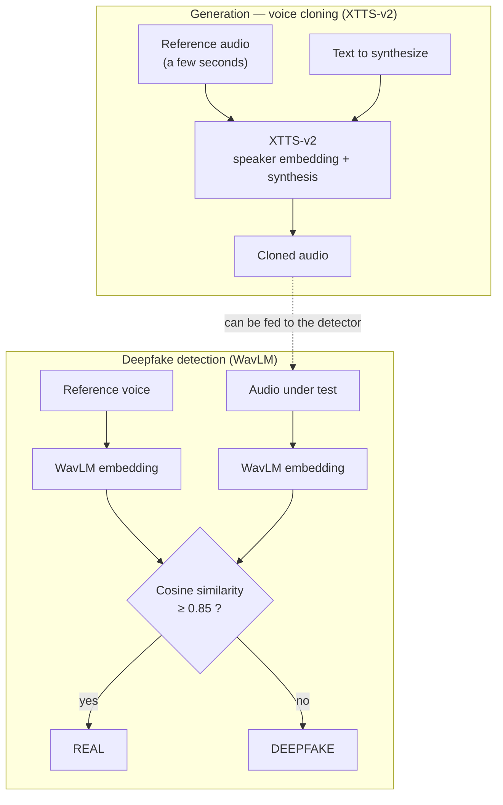

# VoxGuard — Voice cloning & audio deepfake detection

VoxGuard explores **both sides of the same technology**: generating synthetic
voices by cloning, and detecting those synthetic voices. The goal isn't to ship a
ready-to-use cloning tool — it's to understand how these systems work, what risks
they pose (identity theft, bypassing voice authentication), and what
countermeasures — technical and organizational — can be put against them.

- **Generation**: voice cloning with Coqui **XTTS-v2**
- **Detection**: **WavLM** embeddings + cosine similarity
- **Interface**: Streamlit app
- **Framing**: educational project, governed by a usage charter and an ethics memo

> ⚠️ Strictly educational project. Voice cloning is **dual-use technology**: see
> the [Usage Charter](Charte_Usage.md) and the [Ethics Memo](Memoire_Ethique.md).
> No voice may be cloned without the explicit consent of the person concerned.

---

## How it works



### Generation (`src/generator.py`)

The `VoiceGenerator` class uses **XTTS-v2** (Coqui), a multilingual
text-to-speech model. From a few seconds of reference audio it extracts the
speaker's characteristics (*speaker embedding*), then synthesizes any text in
that voice's timbre.

### Detection (`src/detector.py`)

The `DeepfakeDetector` class uses **WavLM** (`microsoft/wavlm-base-plus-sd`) to
turn each audio clip into a vector (*embedding*) summarizing its vocal
characteristics. It then computes the **cosine similarity** between the reference
voice and the audio under test:

- similarity **≥ 0.85** → same speaker → `REAL`
- similarity **< 0.85** → different speaker → `DEEPFAKE`

The 0.85 threshold is a trade-off: lowering it reduces false negatives (fewer
deepfakes missed) but raises false positives (more real voices rejected), and
vice versa — the same detection/false-positive balance as any security control.

---

## Notable implementation detail

XTTS loads and saves audio through `torchaudio`, which by default depends on
`torchcodec` (and therefore FFmpeg shared libraries, absent on the Windows setup
used). Rather than installing the whole FFmpeg chain, `generator.py`
**redirects `torchaudio.load` / `torchaudio.save` to `soundfile`**, which handles
the project's WAV files without FFmpeg. A targeted workaround that avoids a heavy
system dependency.

---

## Install & run

```bash
python -m venv .venv
# Windows: .venv\Scripts\activate     |    Linux/Mac: source .venv/bin/activate
pip install -r requirements.txt

streamlit run app.py
```

The first run downloads the models (XTTS-v2 and WavLM), which can take a few
minutes.

---

## Layout

```
.
├── app.py                  # Streamlit interface (generation + detection)
├── src/
│   ├── generator.py        # XTTS-v2 voice cloning
│   ├── detector.py         # WavLM + cosine deepfake detection
│   └── utils.py            # audio loading, cosine similarity
├── notebooks/
│   ├── 02-Understand-Embeddings.ipynb
│   └── Classification_Deepfake_Detection.ipynb
├── Charte_Usage.md         # usage rules (consent, prohibited uses)
├── Memoire_Ethique.md      # risks, countermeasures, ethical stance
└── requirements.txt
```

---

## Stack

| Domain | Tools |
|--------|-------|
| Speech synthesis | Coqui XTTS-v2 (`coqui-tts`) |
| Detection | WavLM (`transformers`) + PyTorch |
| Audio | librosa, soundfile, torchaudio |
| ML | scikit-learn, numpy, pandas |
| Interface | Streamlit |
| Exploration | Jupyter |

---

## Why this project (cybersecurity context)

Audio deepfakes are a concrete threat: CEO fraud, bypassing bank voice
authentication, identity theft via voice message. VoxGuard tackles the subject
from both sides — understanding the attack (generation) to better design the
defense (detection) — and frames it with a **usage charter** and an **ethics
memo** that explicitly define prohibited uses. It's this defense +
responsibility approach that makes the project valuable.
