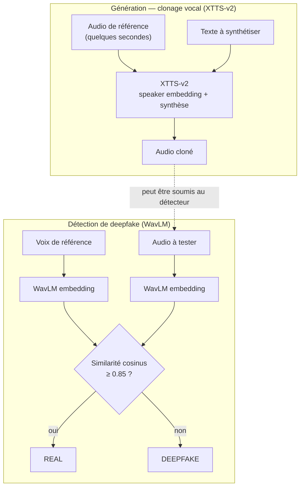

# VoxGuard — Clonage vocal & détection de deepfakes audio

VoxGuard explore les **deux faces d'une même technologie** : la génération de
voix synthétiques par clonage, et la détection de ces voix synthétiques. Le but
n'est pas de livrer un outil de clonage « prêt à l'emploi », mais de comprendre
comment ces systèmes fonctionnent, quels risques ils posent (usurpation
d'identité, contournement de l'authentification vocale), et quelles
contre-mesures — techniques et organisationnelles — on peut y opposer.

- **Génération** : clonage vocal avec Coqui **XTTS-v2**
- **Détection** : embeddings **WavLM** + similarité cosinus
- **Interface** : application Streamlit
- **Cadre** : projet éducatif, encadré par une charte d'usage et un mémoire éthique

> ⚠️ Projet strictement éducatif. Le clonage vocal est une technologie
> **dual-use** : voir la [Charte d'Usage](Charte_Usage.md) et le
> [Mémoire Éthique](Memoire_Ethique.md). Aucune voix ne doit être clonée sans le
> consentement explicite de la personne concernée.

---

## Comment ça marche



### Génération (`src/generator.py`)

La classe `VoiceGenerator` s'appuie sur **XTTS-v2** (Coqui), un modèle de synthèse
vocale multilingue. À partir de quelques secondes d'un audio de référence, il
extrait les caractéristiques du locuteur (*speaker embedding*), puis synthétise
n'importe quel texte avec ce timbre de voix.

### Détection (`src/detector.py`)

La classe `DeepfakeDetector` utilise **WavLM** (`microsoft/wavlm-base-plus-sd`)
pour transformer chaque audio en un vecteur (*embedding*) résumant ses
caractéristiques vocales. On calcule la **similarité cosinus** entre la voix de
référence et l'audio à tester :

- similarité **≥ 0,85** → même locuteur → `REAL`
- similarité **< 0,85** → locuteur différent → `DEEPFAKE`

Le seuil de 0,85 est un compromis : le baisser réduit les faux négatifs (on rate
moins de deepfakes) mais augmente les faux positifs (on rejette des vraies voix),
et inversement — le même arbitrage détection/faux positifs que sur n'importe quel
contrôle de sécurité.

---

## Détail d'implémentation notable

XTTS charge et sauvegarde l'audio via `torchaudio`, qui dépend par défaut de
`torchcodec` (et donc des DLL FFmpeg, absentes sur l'environnement Windows
utilisé). Plutôt que d'installer toute la chaîne FFmpeg, `generator.py`
**redirige `torchaudio.load` / `torchaudio.save` vers `soundfile`**, qui gère les
fichiers WAV du projet sans FFmpeg. Un contournement ciblé qui évite une
dépendance système lourde.

---

## Installation & lancement

```bash
python -m venv .venv
# Windows : .venv\Scripts\activate     |    Linux/Mac : source .venv/bin/activate
pip install -r requirements.txt

streamlit run app.py
```

Le premier lancement télécharge les modèles (XTTS-v2 et WavLM), ce qui peut
prendre quelques minutes.

---

## Structure du dépôt

```
.
├── app.py                  # interface Streamlit (génération + détection)
├── src/
│   ├── generator.py        # clonage vocal XTTS-v2
│   ├── detector.py         # détection deepfake WavLM + cosinus
│   └── utils.py            # chargement audio, similarité cosinus
├── notebooks/
│   ├── 02-Understand-Embeddings.ipynb        # exploration des embeddings
│   └── Classification_Deepfake_Detection.ipynb
├── Charte_Usage.md         # règles d'utilisation (consentement, interdits)
├── Memoire_Ethique.md      # risques, contre-mesures, positionnement éthique
└── requirements.txt
```

---

## Stack technique

| Domaine | Outils |
|---------|--------|
| Synthèse vocale | Coqui XTTS-v2 (`coqui-tts`) |
| Détection | WavLM (`transformers`) + PyTorch |
| Audio | librosa, soundfile, torchaudio |
| ML | scikit-learn, numpy, pandas |
| Interface | Streamlit |
| Exploration | Jupyter |

---

## Pourquoi ce projet (contexte cybersécurité)

Les deepfakes vocaux sont une menace concrète : fraude au président,
contournement de l'authentification vocale bancaire, usurpation d'identité par
message vocal. VoxGuard aborde le sujet des deux côtés — comprendre l'attaque
(génération) pour mieux concevoir la défense (détection) — et l'encadre par une
**charte d'usage** et un **mémoire éthique** qui définissent explicitement les
usages interdits. C'est cette approche défense + responsabilité qui fait la
valeur du projet.
